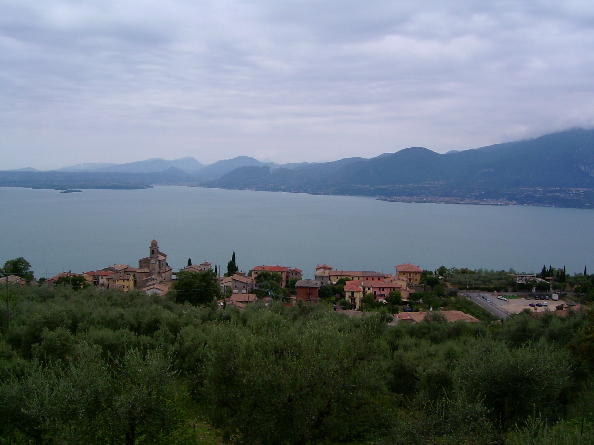

## van Gogh Steering
This project converts arbitrary images into impressionist-style paintings. The employed technique is based on a perlin noise flow field which is layered on top of the original image. A moving particle is placed into this field at a random position. Its movement is calculated according to Craig Reynold's steering behaviour for flow field following as presented in _Reynolds, C. W. (1999, March). Steering behaviors for autonomous characters. In Game developers conference (Vol. 1999, pp. 763-782)._ While this particle moves around, it leaves a colored trace along its path to simulate a brush stroke. The color of this stroke is sampled from the underlying source image. After a certain lifespan the particle is removed and a new one is placed at a random position to restart the process. 

## Examples

## Potential Improvements
* provide more adjustable parameters (noise detail level, fading out effect, ...)
* support other types of noise (e.g. OpenSimplex noise, Worley noise, Value noise, ...)